# Users Guide for QGrain

## Introduction


### Objective

Grain size distributions (GSDs) of clastic sediments can record direct information on changes in the source of material, transporting mechanism and sedimentary environment ([Friedman and Sanders, 1978](https://agris.fao.org/agris-search/search.do?recordID=US201300560426)). Therefore, it has the potential to reveal key information about the paleoenvironment and paleoclimate by analyzing the GSDs. In the past decades, lots of analysis tools have been proposed, which greatly promoted the development of sedimentology. However, no platform can provide most of the analysis methods to facilitate researchers. QGrain aims to provide an easy-to-use and comprehensive analysis platform for grain size distributions. QGrain has implemented many functions, e.g., all functions of GRADISTAT ([Blott and Pye, 2001](https://doi.org/10.1002/esp.261)), single sample unmixing (SSU, previously called curve-fitting), and end member modeling analysis (EMMA). However, there still are many useful tools that have not been contained. Hence, we published QGrain as an open-source project, and welcome other researchers to contribute their ideas and codes. All source codes are available at this GitHub [repository](https://github.com/yuriok/QGrain/).

### Current functions

| Function                      | Description                                                  | Panel                                       |
| ----------------------------- | ------------------------------------------------------------ | ------------------------------------------- |
| Dataset generation            | Randomly generate the artificial dataset to test the functions of QGrain, generating parameters could be fully customized. |                                             |
| Cumulative frequency chart    | Plot the cumulative frequency chart of samples.              | [Statistics](#Cumulative-frequency-chart)   |
| Frequency distribution chart  | Plot the frequency distribution chart of samples.            | [Statistics](#Frequency-distribution-chart) |
| Frequency 3D chart            | Plot the GSDs of samples as a 3D surface, easy to recognize the variation trend of the stratigraphic sequence. However, the back samples may be covered by the front samples. | [Statistics](#Frequency-3D-chart)           |
| Frequency heatmap             | Plot the GSDs of samples as a heatmap. Compared to the 3D chart, it is more suitable for use in publications. | [Statistics](#Frequency-heatmap)            |
| Classification diagrams       | Plot the gravel-sand-mud and sand-silt-clay diagrams of [Folk (1954)](http://www.jstor.org/stable/30065016)'s and [Blott & Pye (2012)](https://doi.org/10.1111/j.1365-3091.2012.01335.x)'s schemes. | [Statistics](#Classification-diagrams)      |
| C-M diagram                   | Plot the C-M diagram to reveal the characteristics of depositional processes of sediments. | [Statistics](#C-M-diagram)                  |
| Statistic parameters          | Calculate the statistic parameters (e.g. mean, sorting, skewness, kurtosis) of grain-size distributions (GSDs). | [Statistics](#Statistics-panel)             |
| GSD classification            | Automatic classification of GSDs, including Folk (1954)’s and Blott & Pye (2012)’s classification schemes. | [Statistics](#Statistics-panel)             |
| Principal component analysis  | Apply the principal component analysis (PCA) algorithm to extract the major and minor signal series in a grain size dataset. | [PCA](#PCA-panel)                           |
| Hierarchical clustering       | Perform a hierarchical clustering (HC) algorithm to have an overall cognition and pick out the typical samples of a grain size dataset. Also could be used to briefly classify the sedimentary facies. | [Clustering](#Clustering-panel)             |
| Single sample unmixing        | Single sample unmixing (SSU) is another unmixing method to separate the mixed grain size distributions. Due to the inherent difficulty of SSU problem, SSU may yield abnormal results and hence be underestimated. To satisfy the existing requirements, a new and enhanced SSU algorithm is provided. | [SSU](#SSU-panel)                           |
| End member modeling analysis  | Provide a new end member modeling analysis (EMMA) algorithm based on the basic neural network to unmix the grain size distributions and extract the latent information of paleoenvironments and paleoclimates. | [EMMA](#EMMA-panel)                         |
| Universal decomposition model | The universal decomposition model (UDM) is a new decomposition approach that integrates the advantages of SSU and EMMA, and it has generally overcome the problem of instability. | [UDM](#UDM-panel)                           |

### Technical route

To achieve this objective, the software techniques were advisedly chosen. [Python](https://www.python.org/), the programing language which has been widely used in scientific computation, machine learning, and many other fields, was chosen as the major developing language of QGrain. Python’s syntax is concise and easy to learn. Python is **open-source** and **FREE** (can be modified at will, and need not pay), and its community is very prosperous. A large number of mature packages (e.g., [Matplotlib](https://matplotlib.org/), [NumPy](https://numpy.org/), [SciPy](https://www.scipy.org/), [scikit-learn](https://scikit-learn.org/), and [PyTorch](https://pytorch.org/)) can be used, which means many repetitive underlying codes are not needed to be written, this feature enables developers can focus on their specific scientific problems. To make QGrain easy to use, it’s necessary to provide a well-designed [GUI](https://en.wikipedia.org/wiki/Graphical_user_interface/) for users who are not familiar with programming. Most of the codes were used to build the GUI. The GUI of QGrain was based on the well-known [cross-platform](https://en.wikipedia.org/wiki/Cross-platform_software/) GUI platform, [Qt](https://www.qt.io/qt-for-python/), this makes QGrain also cross-platform. QGrain also provides many high-quality charts based on the widely used visualization library, [Matplotlib](https://matplotlib.org/).

At present, the basic algorithms are highly dependent on these widely used scientific packages of Python.  It's hard and heavy to switch the technology stack. **Honestly, developing a GUI client with Python is technically unwise.** There are many other more popular solutions,  like WPF, electron,  and many web front-end frameworks. The software distribution is also a technological difficulty for Python programs. Although the solution to these problems was not elegant, we finally finished this project. Meanwhile, we are still thinking about how to improve it. A feasible solution is the separation of front and back ends. Specifically, it uses Python to develop the back-end computational server and uses other languages to develop the front-end GUI client to handle the user input. And it is necessary to solve the communication problems of the front and back ends. **Since the 0.5.0 version, we have separated the core algorithms from the GUI and refactored the basic data models and APIs to support the [GRPC](https://grpc.io). At present, you can start a back-end server on a high-performance PC or workstation to do the calculation, and then open the GUI on another PC, the computing tasks and results can be transmitted over a local area network.** Theoretically, the server can also be deployed on the Internet, but there are more authentication and security works must be taken. With the GRPC server, other front-end technologies are also practicable, but we don't have time to try that yet.

### Contact

If you find some program bugs, or you do not know some technical details, it is recommended to use GitHub's [Issues](https://github.com/yuriok/QGrain/issues/) to report and discuss problems. For some common problems, other users also can check the answers over there to save time. If you have some new functional requirements for QGrain, you can post your ideas in the [Issues](https://github.com/yuriok/QGrain/issues/). Of course, you can contact the author below, directly, do not hesitate.

Yuming Liu, Ph.D. candidate, [liuyuming@ieecas.cn](mailto:liuyuming@ieecas.cn)

---

## Installation

### Quick start

To simplify the install procedure, we have packed the setup file for **Windows** users, just download it, then you can install and run QGrain app. You can download the latest version from [GitHub](https://github.com/yuriok/QGrain/releases/). Or, you can download it from [Google Drive](https://drive.google.com/drive/folders/1Z-xUVpxml9XHPWd0LOgxjtchCPMd1-tn?usp=sharing). **For the users in China, you can download it from [Baidu Drive](https://pan.baidu.com/s/1hau7AruPkpgvzjF-mMCQaQ/), with code: 8bzg.**

### Advanced installation

However, we highly recommend you install Python, then install QGrain as a package. Following this way, you can update QGrain much easier. In addition, the packed software can not use NVIDIA GPU to accelerate the computation. 

For **Linux** and **Mac OS X** users, the Python interpreter is built-in. For **Windows** users, you need to install [Python](https://www.python.org/) first. You can run the command `python` or `python3` in your `Terminal` (`CMD` or `PowerShell` in Windows) to check if Python is existing. Note, using `python` or `python3` depends on the alias or the filename of your Python3 interpreter, rather than you can choose Python2 or Python3 at liberty. Python2 is too old and has been obsoleted. For Linux and Mac OS X, command `python3` usually is correct, and for `Windows`, command `python` usually is correct. Furthermore, the choosing of command `pip` and `pip3` follows the same rule.

Then, you can use `pip` to install QGrain.

```bash
pip install QGrain
```

You can update QGrain like this.

```bash
pip install -U QGrain
```

Or, install the specific version, if you have strong reasons. For example, your script was written under the old version, and the new version changed the APIs.

```bash
pip install QGrain==0.5.1.0
```

Then, you can start the GUI of QGrain by running the command `qgrain`. The software will generate an artificial dataset and perform all algorithms to demonstrate its functions. So, it will start a bit slowly, please wait a moment.

Finally, you will see the initial interface below.

<figure>
    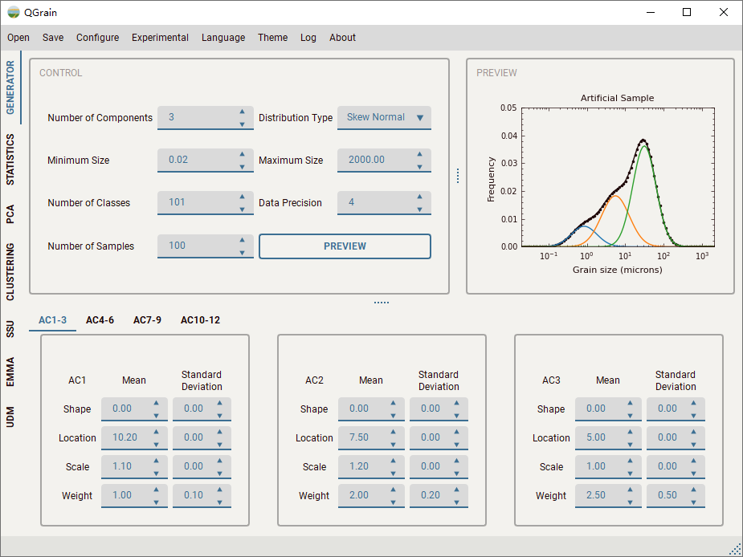
    <figcaption><bold>Figure 1.</bold> The initial interface of QGrain App. It is showing the generator panel.</figcaption>
</figure>

### Enable CUDA

Some functions (e.g., EMMA and UDM algorithms) can use CUDA to accelerate the computation. By default, QGrain app only packed the CPU version of PyTorch, because not all users have a high-performance NVIDIA GPU, and the CPU is faster to handle a small dataset. It needs more steps to enable the CUDA, not only install a CUDA version of PyTorch, but NVIDIA GPU driver, [CUDA Toolkit](https://developer.nvidia.com/cuda-toolkit/) and [CUDNN](https://developer.nvidia.com/cudnn/) also should be installed. Follow the guides of PyTorch and NVIDIA to install them. If all of them have been installed, the `cuda` option in the `device` combo box can be selected.

---

## Software usages

In this chapter, we will introduce the designs and usages of GUI. As mentioned above, the GUI is easier to use compared to coding. However, only basic and mature functions have corresponding interfaces. If you are not satisfied with the limited functions, you can check the next chapter to see script usages.

### Overview of UI

The GUI consists of several panels, you can switch the panel by clicking the corresponding tab (e.g., `Statistics`) on the left side (see Fig. 1). Each panel provides a set of functions. The details of each panel will be introduced below. In addition, there are a menu bar and a status bar. By triggering the actions in the menu bar, you can open a new grain size dataset, save analysis results, change languages and themes, etc. The status bar can show some messages and hints for users. You can open the `Runtime Log` window to see more runtime details by clicking the `Log` option in the menu bar.

### Load a grain size dataset

Before analyzing, we should load the GSDs into the software. This procedure is most likely to go wrong because only a specific layout of data can be read directly. If you are not sure whether your data meets the requirements, you can generate an artificial dataset by the `Generator` panel, and check its `Dataset` sheet for details.

By clicking the `Grain Size Dataset` action in the `Open` menu, you will see a dialog popped up to ask you to select the filename, choose the sheet, and assign the rows and columns. By clicking the `Select` button in the dialog, a file dialog will be popped up to ask you to select a file. At present, this file could be `*.csv`, `*.xls` and `*.xlsx` formats. If there is no error raised (e.g., the selected file is occupied by another program), the sheet names of Excel files will be read as the options in the `Sheet Name` combo box. If you select a `*.csv` file, there will be only one option in this combo box, that's the filename.

<figure>
    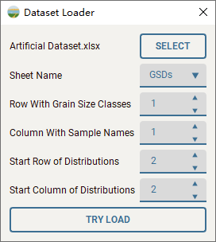
    <figcaption><bold>Figure 2.</bold> The dialog of dataset loader.</figcaption>
</figure>

For Excel files, one file can contain multiple sheets, it's suitable for placing the related but different types of information in different sheets. For example, the output files of QGrain usually put a `README` sheet to give a brief description of this file and put other sheets after this sheet. Here, we need to choose the `Dataset` sheet. By default, it will load the first row as the grain size classes, and the first column is used to put the names of samples, GSDs are tight with the classes and names. The default output layout of QGrain is correct, so, just click the `Try Load` button. If your dataset does not follow this data layout, i.e., it has additional rows or columns, you can change the layout settings to load it. Considering the complexity, we only support the horizontal layout (i.e., each row is one sample). If your dataset is vertical (i.e., each column is one sample), it's easy to transform it using other software (e.g., Microsoft Excel).

The unit of grain size classes should be $\mu m$, the values should be incremental (i.e., left columns are finer and right columns are coarser), and the intervals between any two adjacent classes should  equal in $\phi$ scale. If there is a text cell in the row of grain size classes, it will raise an error. The names of samples should be texts, if they are numbers, they will be converted to texts. The distribution values of each sample should be numerical, and the sum of them should be 1 or 100. Note, if there is an empty cell in the row of distribution, it will raise an error. You can use empty rows to separate samples, but the rows should be fully empty. In addition, please don't put some individual cells out of the range of distributions. Note, although we have written some codes to validate the data, there may still be some errors ignored. Please make sure your GSDs are valid. If the loading failed, you can check the `Runtime Log` window for details, by clicking the `Log` action in the menu bar.

### Generator panel

The `Generator` panel provides the functions to generate random datasets. You can use artificial datasets to test other algorithms. If you want to try QGrain but have no dataset, this module may be helpful. Or, if you are not clear with the functions and settings of algorithms, you can generate a series of different datasets to observe the performances of algorithms and explore the impacts of settings. Of course, it can be used to generate some difficult datasets to test the limitations and constraints of these algorithms. By generating a similar dataset as your real-world dataset, you can make sure whether these algorithms can handle your real-world dataset well because all original information of an artificial dataset is known. However, there is another critical question, that's how to make the artificial dataset as realistic as possible.

#### Mixture versus decomposition

Before introducing the usages, you may need to know some related sedimentological cognitions on the formation of GSDs. In other words, how did the GSDs of sediments become polymodal? And, what are the geological meanings of the sub-populations? Because the generation of an artificial dataset essentially is the simulation of this natural mixing process. This article assumes you have corresponding knowledge background.

After understanding the mixture model of the formation of GSDs, it is easy to accept the idea that mathematical decomposition can restore the mixture process and reveal the key information of related sedimentary processes.

#### Generate one sample

A polymodal sample could be regarded as the mixture of several unimodal sub-populations, and the sub-population can be associated with a certain sedimentary process. Based on this theoretical model, it's very easy to generate artificial samples. In mathematics, the mixture can be regarded as the summation of all sub-populations in specific proportions. Therefore, for one sample, we need to generate a set of sub-populations and corresponding proportions. Usually, we use an elementary distribution function (e.g., Gaussian or Weibull) and specify the function parameters of all sub-populations. In the choosing of the distribution function, there are many discussions but no conclusion. Here, we provide 4 common distribution functions, i.e., normal (Gaussian), skew-normal, Weibull, and general Weibull. Note that, all distribution functions are on a logarithmic scale (i.e., the unit is $\phi$, not $\mu m$). By default, we use the [skew-normal](https://en.wikipedia.org/wiki/Skew_normal_distribution) distribution as the elementary distribution to generate the sub-populations. skew-normal distribution is based on normal (Gaussian) distribution but provides an additional parameter to control the skewness. Therefore, it's more flexible than the normal distribution, each elementary distribution has three parameters, `shape` ($\alpha$), `location` ($\mu$), and `scale` ($\sigma$). The `shape` ($\alpha$) controls its skewness, when $\alpha=0$, it becomes a normal distribution. Note, due to its mathematical definition, the skewness ($S_k$) is limited to the interval $(-1,1)$. The interval integral should be applied to the probability density function (PDF) to discretize and transform it to frequency. Multiply the proportions of sub-populations to their frequencies, and then sum them, the mixed frequency is obtained. By calculating the frequency of each grain size class, we can get the artificial sample.

#### Mathematical definition

Let $\phi(x)$ denote the PDF of standard normal distribution, there is

$$
\phi(x)=\frac{1}{\sqrt{2\pi}}\exp\left(-\frac{x^2}{2}\right)
$$
With the cumulative distribution function given by

$$
\Phi(x) = \int_{-\infty}^{x} \phi(t)\ dt = \frac{1}{2}\left[1+\operatorname{erf}\left(\frac{x}{\sqrt{2}}\right)\right]
$$

where $\operatorname{erf}$ is the [error](https://en.wikipedia.org/wiki/Error_function) function. Then the PDF of the skew-normal distribution with the shape parameter $\alpha$ is given by

$$
PDF(x)=2\phi(x)\Phi(\alpha x)
$$
To add the location ($\mu$) and scale ($\sigma$) parameters, one makes the usual transform $x\rightarrow{\frac{x-\mu}{\sigma}}$. Then, the PDF becomes

$$
PDF(x, \mu, \sigma)={\frac{2}{\sigma}}\phi \left({\frac{x-\mu}{\sigma}}\right)\Phi \left(\alpha \left({\frac{x-\mu}{\sigma}}\right)\right).
$$
To transform density to frequency, an interval integral should be applied

$$
f_j = \int_{x_j-\frac{\delta}{2}}^{x_j+\frac{\delta}{2}} PDF(x_j),
$$
where $f_j$ is the frequency of $j$-th grain size class, $x_j$ is its grain size in $\phi$ scale, $\delta$ is the interval of adjacent grain size classes (in $\phi$ scale).

Let bold symbols denote the vectors, $\boldsymbol{f}$ is the observed GSD of one sample, $\boldsymbol{f}_k$ is the elementary frequency distribution of $k$-th sub-population. Let $p_k$ denote the proportion of the $k$-th sub-population. There is:

$$
\boldsymbol{f} = p_1 \boldsymbol{f}_1 + p_2 \boldsymbol{f}_2 + \cdots + p_q \boldsymbol{f}_q.
$$

For other distribution functions, just change the PDF. Of course, the parameters except $x$ may be different.

#### Generate a batch of samples

While generating one sample, it is easy to manually assign the function parameters and proportions. Hoswever, in most test scenarios, we need a batch of samples (i.e., a dataset) to evaluate the performance of different algorithms. To generate the dataset, a batch of function parameters and proportions are needed. There are two approaches to generate the parameters and proportions. The first approach is using random numbers. Another way is using signal series (e.g., sinusoidal wave). The `Generator` panel provides the former approach. Each parameter is randomly generated and controlled by mean $\mu_p$ and standard deviation $\sigma_p$ of a normal distribution. To simulate the actual observation, values will be rounded to the precision (e.g., 0.01%), and a group of Gaussian noise (an order of magnitude less than precision) will be overlaid on it.

The figure above shows the interface of the `Generator` panel. In the `Control` box, you can control the sampling settings, i.e., sampling range, interval (number of classes) and precision. In addition, you can change the elementary distribution function and the number of components. By clicking the `Preview` button, artificial samples will be generated and displayed successively, using the random parameters at the bottom. Each small box is related to an artificial component, the number of parameters depends on the distribution type. Finally, adjust the number of samples and click the `Artificial Dataset` option in the `Save` menu, the artificial dataset can be saved into an Excel file.

If you want to generate more complicated or realistic datasets. You can check the [section](#How-to-generate-a-more-complicated-dataset) below.

### Statistics panel

This panel is designed to provide the basic analysis and visualization for a brief view of the dataset. All functions in GRADISTAT ([Blott and Pye, 2001](https://doi.org/10.1002/esp.261)) can be found here. Its main content is a table to display statistical parameters and classification groups. You can resize the window or adjust the sliders to see more information. To keep it simple and efficient, all samples have been divided into several pages, each page shows 20 samples. By clicking the `Previous` or `Next` button, you can jump to the previous or next page. You also can click the combo box to select a page directly. Below, there are two checkboxes that control the method to calculate statistical parameters. Another combo box is used to adjust the grades of proportions.

<figure>
    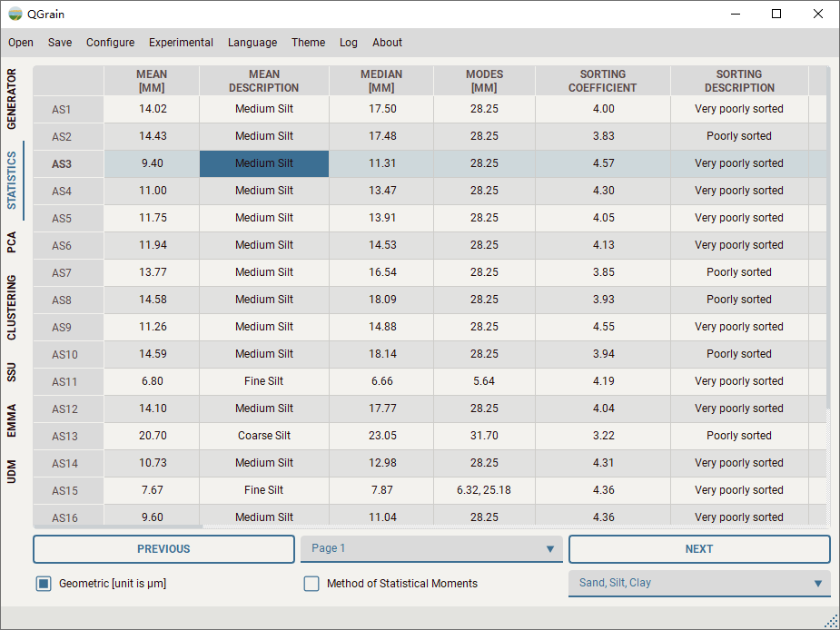
    <figcaption><bold>Figure 3.</bold> The interface of the statistics panel.</figcaption>
</figure>

You can choose the option `Statistical Result` in the `Save` menu to save the statistical result to an Excel file.

**Right-click the table region, then, a menu showing the available actions will be popped up.** By choosing the actions in the menu, you can plot some basic charts, including the frequency distribution chart, frequency 3D chart, cumulative frequency chart, and classification diagrams of [Folk (1954)](https://www.jstor.org/stable/30065016) and [Blott and Pye (2012)](https://doi.org/10.1111/j.1365-3091.2012.01335.x).

To be more flexible, each chart provides 4 sub-actions.

* `Plot`: Clear previous samples in the chart and plot selected samples.
* `Append`: Append selected samples to the chart.
* `Plot All`: Clear previous samples in the chart, and plot all samples of the current dataset.
* `Append All`: Append all samples of the current dataset to the chart.

These charts are based on the well-known visualization module [Matplotlib](https://matplotlib.org/) and use the style module [SciencePlot](https://github.com/garrettj403/SciencePlots) to refine their appearances. In principle, all data are available, if you can not find what you need, feel free to contact the [author](mailto:liuyuming@ieecas.cn). By right-clicking the chart, you will find the option to edit and save the figure. By clicking the edit option, a dialog provided by [Matplotlib](https://matplotlib.org/) will pop up and make you can modify the elements (e.g., title, labels, colors, etc.) of the figure. Most bitmap (e.g., `*.png`, `*.jpg`, `*.tif`) and vector graph (e.g., `*.svg`, `*.eps`) formats are supported.

#### Cumulative frequency chart

The cumulative frequency chart is classical. It is used to discriminate different sedimentary dynamics.

<figure>
    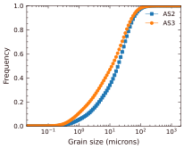
    <figcaption><bold>Figure 4.</bold> The cumulative frequency chart shows two artificial samples.</figcaption>
</figure>

#### Frequency distribution chart

The frequency distribution chart is the most commonly used chart to show the detailed characteristics of grain size samples. With this chart, you can easily recognize the particle abundances of different grain size classes. And you can easily take a comparison of several samples.

<figure>
    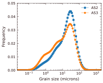
    <figcaption><bold>Figure 5.</bold> The frequency distribution chart shows two artificial samples.</figcaption>
</figure>

#### Frequency 3D chart

If you want to show a batch of samples, the frequency distribution chart may be not suitable, because the sample may be covered by other samples. You can use the frequency 3D chart to show them. In this chart, the variation trend of samples  can be easily discovered. In the chart window, hold down the left mouse button, move the mouse, you can rotate the view.

<figure>
    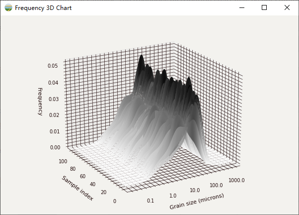
    <figcaption><bold>Figure 6.</bold> The frequency 3D chart simultaneously shows a batch of samples as a 3D surface.</figcaption>
</figure>

#### Frequency heatmap

The frequency heatmap is another way to visualize the GSDs of many samples and has been widely used in publications.

<figure>
    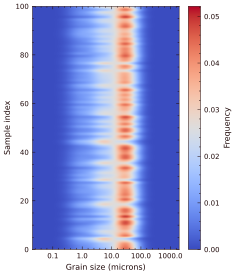
    <figcaption><bold>Figure 7.</bold> The frequency heatmap simultaneously shows a batch of samples as a heatmap.</figcaption>
</figure>

#### Classification diagrams

There are many different classification diagrams which have been widely used in sedimentology, geomorphology, soil science, aquatic ecology and civil engineering ([Blott & Pye, 2012](https://doi.org/10.1111/j.1365-3091.2012.01335.x)). Due to the limitation of time, only [Folk (1954)](http://www.jstor.org/stable/30065016)'s and [Blott & Pye (2012)](https://doi.org/10.1111/j.1365-3091.2012.01335.x)'s schemes are provided at present.

##### Gravel-sand-mud diagram (Folk, 1954)

<figure>
    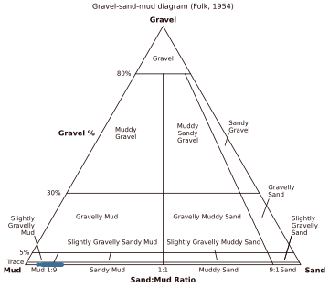
    <figcaption><bold>Figure 8.</bold> The gravel-sand-mud diagram (Folk, 1954) shows the classification groups of a batch of samples.</figcaption>
</figure>

##### Sand-silt-clay diagram (Folk, 1954)

<figure>
    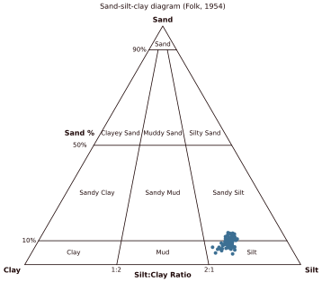
    <figcaption><bold>Figure 9.</bold> The sand-silt-clay diagram (Folk, 1954).</figcaption>
</figure>

##### Gravel-sand-mud diagram (Blott & Pye, 2012)

<figure>
    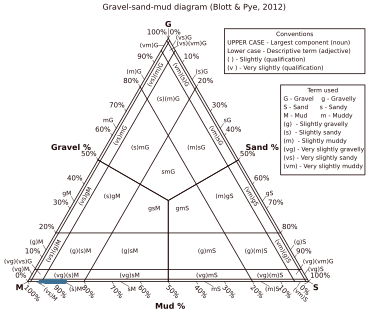
    <figcaption><bold>Figure 10.</bold> The gravel-sand-mud diagram (Blott & Pye, 2012).</figcaption>
</figure>

##### Sand-silt-clay diagram (Blott & Pye, 2012)

<figure>
    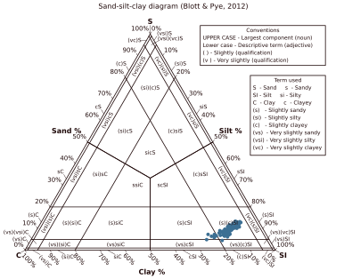
    <figcaption><bold>Figure 11.</bold> The sand-silt-clay diagram (Blott & Pye, 2012).</figcaption>
</figure>

#### C-M diagram

Since the first discussion of C-M patterns ([Passega, 1957](https://doi.org/10.1306/0BDA594E-16BD-11D7-8645000102C1865D)), the C-M diagram has been widely used to reflect the depositional processes of sediments. The C-M diagram below is modified after [Mycielska-Dowgiałło & Ludwikowska-Kędzia (2011)](https://doi.org/10.2478/v10118-011-0010-9). See the description of symbols from [Passega (1964)](https://doi.org/10.1306/74D711A4-2B21-11D7-8648000102C1865D), [Passega & Byramjee (1969)](https://doi.org/10.1111/j.1365-3091.1969.tb00171.x) and [Mycielska-Dowgiałło & Ludwikowska-Kędzia (2011)](https://doi.org/10.2478/v10118-011-0010-9).

<figure>
    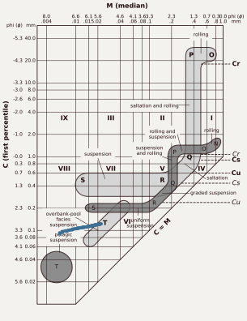
    <figcaption><bold>Figure 12.</bold> The C-M diagram of generated samples.</figcaption>
</figure>

### PCA panel

[Principal component analysis](https://en.wikipedia.org/wiki/Principal_component_analysis) (PCA) is a widely-used tool to handle high-dimensional data. As typically high-dimensional data, grain size distributions also could be processed by PCA. QGrain has integrated the basic PCA to extract the major and minor variations of GSDs. The interface is very simple, when the grain size dataset is loaded, the PCA algorithm will be performed automatically, and the PCA result will be shown in the PCA panel. By clicking the `PCA Result` option in the `Save` menu, you can save the PCA result to an Excel file.

<figure>
    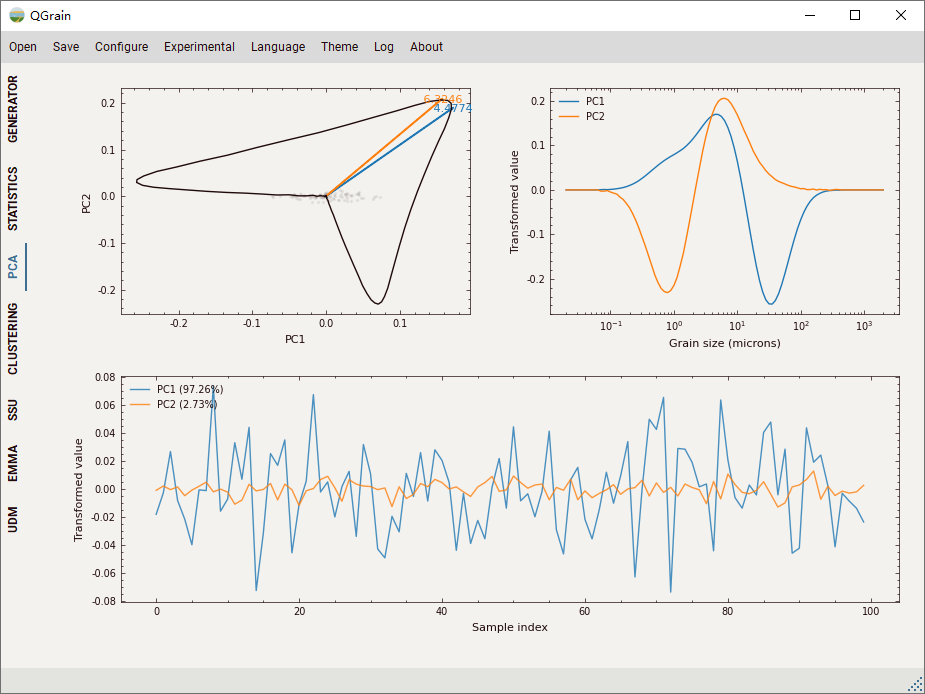
    <figcaption><bold>Figure 13.</bold> The interface of the PCA panel.</figcaption>
</figure>


The only question for you is how to understand the result. There are many documents introducing the algorithm of PCA. After reading them, you may understand the result better. The subfigure at the top-left is modified from the biplot, it uses the principal components, PC1 and PC2, to construct the coordinate system, hence showing the relationships of the original dimensions. Because the number of dimensions of GSDs is too large, it is not suitable to show all dimensions with arrows. Therefore, only the dimensions which are closest to PC1 and PC2 are presented with arrows. The points of other dimensions are connected to form a shape. The gray points show the grain size samples.

The subfigure at the top-right shows the eigenvector (viz. distribution) of PC1 and PC2. The curves are similar to the frequency distribution curves. The difference is that the values may be negative and their sums may not equal 1. Due to this difference, it is difficult to link the distributions of PCs to geological meanings. However, we can determine the sensitive grain size classes by checking this subfigure. For example, the grain size classes of the peaks are most sensitive and preserve the key information of GSDs.

The subfigure at the bottom shows the variations of eigenvalues of PC1 and PC2. The labels in the legend give the explained variance ratios which can be regarded as the degrees of importance for corresponding principal components. For example, the explained ratio of PC1 in the figure above is 97.26%, which means PC1 is the absolute predominant component.

### Clustering panel

[Hierarchical clustering](https://en.wikipedia.org/wiki/Hierarchical_clustering) (HC) is one kind of clustering method. The hierarchical algorithm provided by the [hierarchy](https://docs.scipy.org/doc/scipy/reference/cluster.hierarchy.html) submodule in [SciPy](https://www.scipy.org/) has been integrated into QGrain. You can use this function to filter the typical samples, trim the dataset and take a brief classification of sedimentary facies. The algorithm will be automatically performed if a new dataset has been loaded. By clicking the `Clustering Result` option in the `Save` menu, you can save the clustering result to an Excel file.

<figure>
    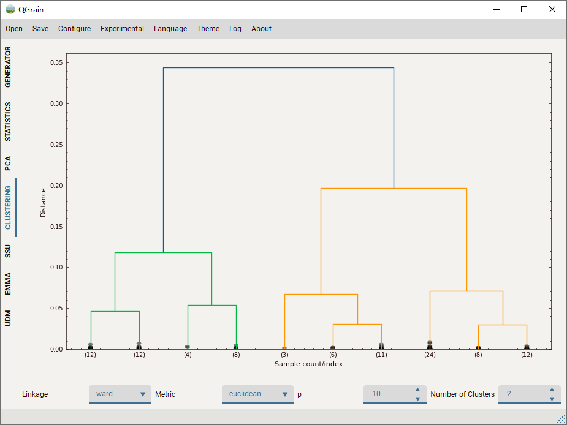
    <figcaption><bold>Figure 14.</bold> The interface of the clustering panel.</figcaption>
</figure>

You could see a dendrogram at the interface. It shows the relationships between different samples. At the top, all samples are in the same cluster. When it goes down, the cluster will be split into two new clusters, and so on. At the bottom, each sample is in its cluster. If the number of samples is too great, it’s difficult to show all labels of the bottom layer. Hence, it’s truncated and only shows `p` bottom leaves, you can change the `p` to show more or fewer bottom leaves. Note that, `p` only affects the figure, it has no influence on the clustering result. You can change the `Number of Clusters` to control the clustering algorithm.

If you want to classify sedimentary facies, you must make sure that the number of clusters could distinguish different sedimentary facies. After that, you could map the clusters to certain sedimentary facies according to the geological settings and other evidence. Note that, different functions which are used to calculate the similarities between samples may have different sensibilities to the transition of sedimentary facies. There is no research on which distance metric is more suitable for the classification of sedimentary facies. Therefore, the current version of QGrain only uses the whole GSDs to calculate distances, this may ignore some minor sub-populations. It may be better to do clustering with the decomposition results.

### SSU panel

SSU (viz. curve-fitting) is the first mathematical method to decompose the polymodal GSD into several elementary components ([Sheridan et al., 1987](https://doi.org/10.1130/0091-7613(1987)15<367:DOGSIP>2.0.CO;2); [Weltje & Prins, 2003](https://doi.org/10.1016/S0037-0738(03)00235-5)). SSU has been widely used in different types of sediments. Although it has been gradually replaced by EMMA, there are still some researchers thinking it has some unique features ([Wu et al., 2020](https://doi.org/10.1016/j.sedgeo.2020.105590); [Liu et al., 2021](https://doi.org/10.1016/j.sedgeo.2021.105980); [Peng et al., 2022](https://doi.org/10.1016/j.sedgeo.2022.106211)).

The interface of the SSU panel is the most complex among these panels. But don't worry, these options and parameters are designed to make you have the ability to handle the most difficult samples, and it's no need to do tedious adjusting work for all samples.

<figure>
    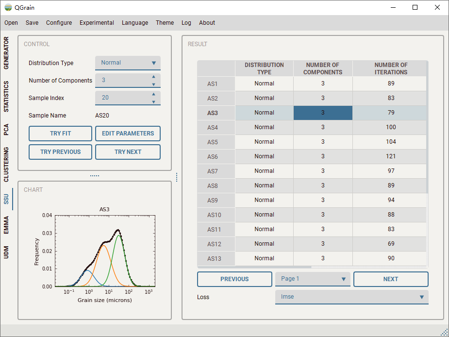
    <figcaption><bold>Figure 15.</bold> The interface of the SSU panel.</figcaption>
</figure>

You can adjust the `Sample Index` to switch the current sample which is ready for fitting. The `Sample Name` below is going to change synchronously as `Sample Index` changes. By clicking the `Try Fit` button, the current sample will be decomposed with current settings. The introduction to adjusting the settings will be given at the following paragraphs. By clicking the `Try Previous` or `Try Next` button, you can decompose the previous or next sample. After fitting, the decomposed result will be displayed in the `Result` table, you can see some basic information about the fitting process.  At the same time, the result will be visualized in the chart.

Right-click on the `Result` table, you can see the menu to do actions on the decomposed results, e.g., remove the selected or all results. You also can show the selected result in the chart if you want to check the previous result. While the `Auto Show` option is checked, the selected result will be automatically displayed in the chart. In addition, you can show the variation of loss in the fitting process and the resolved parameters. There are several sub-options in the `Check` action, you can use them to remove the outliers in the table. Right-click on the `Chart` region, you can see the menu to affect the chart. By checking the `Animated` option, the fitting process will be displayed with the animation.


You can click the `SSU Algorithm` option in the `Configure` menu to open the dialog to adjust the algorithm settings of SSU. Basically, you don't need to change the following settings. At first, you can choose the loss function to calculate the distance between the observed and predicated GSDs. In practice, the logarithmic mean squared error (LMSE) is better than other loss functions. Moreover, you can select the optimizer (i.e. optimization algorithm). For some optimizers (e.g., Powell), it needs more iterations, you may need to change the `Maximum Number of Iterations of Optimizer`. If you check the `Global Optimization`, it will use the [`basinhopping`](https://docs.scipy.org/doc/scipy/reference/generated/scipy.optimize.basinhopping.html) algorithm to find the global minimum.

<figure>
    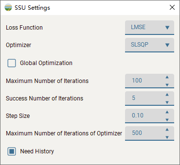
    <figcaption><bold>Figure 16.</bold> The algorithm settings of SSU.</figcaption>
</figure>

If your sample has more than 3 components and the proportions of some components are very low, it's recommended to click the `Edit Parameters` button to fitting the current sample manually. At the `Parameter Editor`, you can manually set the initial parameters to each component. No need to be very accurate. Then click the `Enable` checkbox, and try to fit the sample again. **Note that, if the `Enable` checkbox is not checked, the parameters in the `Parameter Editor` will not work.** The `Parameter Editor` is very important. It enables you to handle the complex samples. By clicking the `Refer Parameter` action in the result menu of SSU, you can transmit the resolved parameters of the selected SSU result to the `Parameter Editor`. It is convenient to utilize the fitting results of other samples as the references to decompose the next sample. Furthermore, the panels of SSU, EMMA and UDM share the same `Parameter Editor`, which means you can utilize the result of SSU while performing the EMMA or UDM algorithm to the whole dataset.

<figure>
    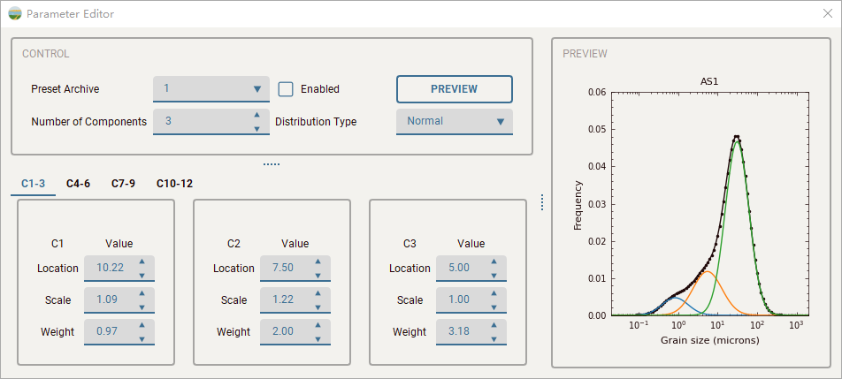
    <figcaption><bold>Figure 17.</bold> The interface of the parameter editor.</figcaption>
</figure>

Finally, you can select the `SSU Results` action in the `Save` menu to save the results into an Excel file or a binary file. **It's recommended to also save a binary file because it could preserve the fitting history and could be reloaded by the QGrain software.**

### EMMA panel

This panel provides a new EMMA algorithm (NNEMMA) which is based on the basic neural network ([Liu et al., 2021](https://doi.org/10.1016/j.sedgeo.2021.105980)). It supports bot only nonparametric EMMA but also parametric EMMA. In addition, you even can customize the end members, if you could determine them by other methods, e.g., taking samples from the sources. Just click the `Try Fit` button, it will decompose the dataset with the current settings. After fitting, the EMMA result will be placed in the `Result` list. You can click the `Remove` or `Show` button at below to remove or show the selected result. Right-click on the chart, the chart menu will be popped up, you also can display the fitting process by checking the `Animated` checkbox.

<figure>
    
    <figcaption><bold>Figure 18.</bold> The interface of the EMMA panel.</figcaption>
</figure>

You can click the `EMMA Algorithm` option in the `Configure` menu to open the dialog to adjust the algorithm settings of NNEMMA. By observing the chart of the selected fitting result, you can judge that whether the algorithm has converged to the limit and whether the fitting result has unmixed the end members well. If it did not converge to the limit, please increase the minimum and maximum number of epochs in the algorithm settings. If the loss variation is too volatile, you need to decrease the learning rate. Adjust the settings until you are satisfied, and then save the corresponding result to an Excel file or a binary file.

<figure>
    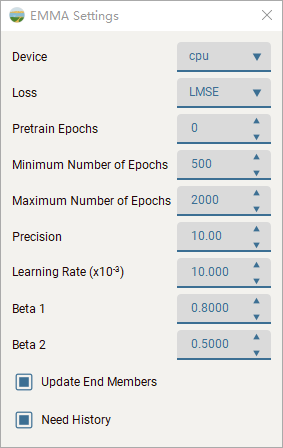
    <figcaption><bold>Figure 19.</bold> The algorithm settings of EMMA.</figcaption>
</figure>

### UDM panel

The interface of the UDM panel is very similar to that of the EMMA panel.

<figure>
    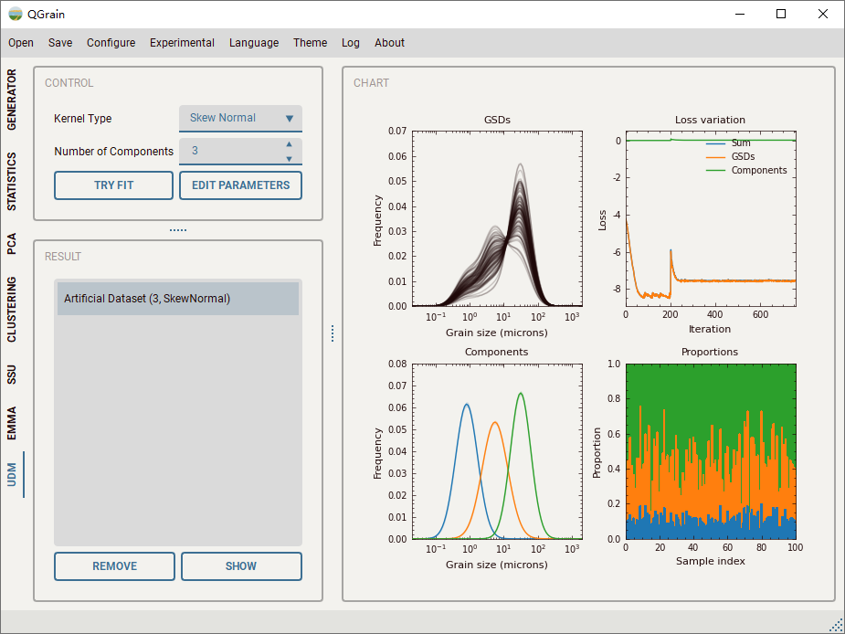
    <figcaption><bold>Figure 20.</bold> The interface of the UDM panel.</figcaption>
</figure>

---

## Script usages

### How to load a grain size dataset

The `io` submodule provides the functions to load a grain size dataset and save different results to the Excel files.

It is very easy to load a grain size dataset by codes. Just call the `load_dataset` function.

```python
from QGrain.io import load_dataset
dataset = load_dataset("GSDs.xlsx")
```

You can load a more complicated data file with additional parameters.

```python
from QGrain.io import load_dataset, DataLayoutSetting
dataset = load_dataset("GSDs.xlsx", sheet_index=0,
                       class_row=0, name_col=0, start_row=1, start_col=2)
```

### How to generate a random dataset

The `generate` submodule provides the functions to generate artificial datasets. If you just need some samples but do not care about their details, you can get the samples as follow. It will use the built-in preset to generate a sample (`ArtificialSample` object) or a dataset (`ArtificialDataset` object).

```python
from QGrain.generate import random_sample, random_dataset, SIMPLE_PRESET
sample = random_sample(**SIMPLE_PRESET)
dataset = random_dataset(**SIMPLE_PRESET, n_samples=200)
```

You can define your own preset to generate a specific random dataset. The `preset` is a `dict`. `target` is a list that contains `n` elements, each element also is a `list` and related to an artificial component. Each `tuple` is corresponding to the `parameter` of an artificial component and contains the $\mu_p$ and $\sigma_p$, respectively. For this case, the parameters of the skew-normal distribution are shape ($\alpha$), location ($\mu$), scale ($\sigma$), weight ($\omega$), respectively.

```python
from QGrain.models import DistributionType
from QGrain.generate import random_dataset

preset = dict(target=[
    [(0.0, 0.0), (10.2, 0.0), (1.1, 0.0), (1.0, 0.1)],
    [(0.0, 0.0), (7.5, 0.0), (1.2, 0.0), (2.0, 0.2)],
    [(0.0, 0.0), (5.0, 0.0), (1.0, 0.0), (2.5, 0.5)]],
    distribution_type=DistributionType.SkewNormal)

dataset = random_dataset(**preset, n_samples=100,
                         min_size=0.02, max_size=2000.0, n_classes=101,
                         precision=4, noise=5)
```

### How to generate a more complicated dataset

Here, we will show you how to generate a more complicated dataset. You can generate the function parameters for all samples. Then, pack them into a three-dimensional array with the specific form, and call the constructor of `ArtificalDataset` to generate the dataset.

For different distribution functions, the parameters of each artificial component are different. You can check the following table for details. You can generate several one-dimensional arrays, and transform them to parameter series. The length of these series is the number of samples. If you want to make the dataset realistic, it is better to take more geological and sedimentological considerations while making the parameter series. For example, you should imagine a sedimentary model. Then, you can determine the number of necessary components. Later, you can arrange a major dynamics process for each component. Finally, you can create the parameter series by simulating the variations of dynamics processes. Or, you can use some paleoenvironmental or paleoclimatic records to represent the variations. In the following case, we did not take too many geological and sedimentological considerations on it. Just use sinusoidal signals to generate the parameter series.

| Distribution Function | Shape | Location | Scale | Weight | Number of Parameters |
| --------------------- | ----- | -------- | ----- | ------ | -------------------- |
| Normal                | ×     | √        | √     | √      | 3                    |
| Skew Normal           | √     | √        | √     | √      | 4                    |
| Weibull               | √     | ×        | √     | √      | 3                    |
| General Weibull       | √     | √        | √     | √      | 4                    |

In practice, it is difficult to generate the dataset based on Weibull (or general Weibull) function. Because, it is hard to control the mean grain size and sorting coefficient. But for the normal distribution, the location parameter $\mu$ is mean grain size, the scale parameter $\sigma$ is sorting coefficient. It is easy to interpret them and link them to specific dynamics parameters.

```python
import numpy as np
from QGrain.models import ArtificialDataset, DistributionType
from QGrain.distributions import Normal
from QGrain.io import save_artificial_dataset

distribution_type = DistributionType.Normal
n_components = 3
n_samples = 200

# generate signal series
x = np.linspace(-10, 10, n_samples)
series_1 = np.sin(x)
series_2 = np.cos(x)

# use series to generate parameters
# mean, std are the function parameters of normal distribution
# weight is used to calculate the proportion
C1_mean = np.random.random(n_samples) * 0.05 + 10.2
C1_std = np.random.random(n_samples) * 0.05 + 0.55
C1_weight = np.random.random(n_samples) * 0.01
C2_mean = series_1 * 0.1 + 7.8 + np.random.random(n_samples) * 0.01
C2_std = np.random.random(n_samples) * 0.04 + 0.8
C2_weight = series_1 * 0.2 + 1.0 + np.random.random(n_samples) * 0.01
C3_mean = series_2 * 0.2 + 5.5 + np.random.random(n_samples) * 0.01
C3_std = np.random.random(n_samples) * 0.04 + 0.7
C3_weight = series_2 * 0.4 + 1.0 + np.random.random(n_samples) * 0.01

# pack the parameters
parameters = np.ones((n_samples, Normal.N_PARAMETERS+1, n_components))
parameters[:, 0, 0] = C1_mean
parameters[:, 1, 0] = C1_std
parameters[:, 2, 0] = C1_weight
parameters[:, 0, 1] = C2_mean
parameters[:, 1, 1] = C2_std
parameters[:, 2, 1] = C2_weight
parameters[:, 0, 2] = C3_mean
parameters[:, 1, 2] = C3_std
parameters[:, 2, 2] = C3_weight

# construct the dataset
dataset = ArtificialDataset(parameters, distribution_type,
                            min_size=0.02, max_size=2000, n_classes=101,
                            precision=4, noise=5)
save_artificial_dataset(dataset, "./Artificial Dataset.xlsx")
```

<figure>
    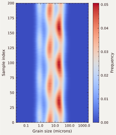
    <figcaption><bold>Figure 21.</bold> The frequency heatmap of this artificial dataset.</figcaption>
</figure>

### How to perform statistical analysis and save the result

The `statistics` submodule provides the functions to calculate the statistical parameters. The `all_statistics` function will use all statistical methods in GRADISTAT ([Blott and Pye, 2001](https://doi.org/10.1002/esp.261)) to analyze the GSD. You need to pass there one-dimensional arrays, they are the grain size classes in $\mu m$ and $\phi$ scales, and the GSD.

```python
from QGrain.generate import SIMPLE_PRESET, random_sample
from QGrain.statistics import all_statistics

sample = random_sample(**SIMPLE_PRESET)
statistics = all_statistics(sample.classes, sample.classes_phi, sample.distribution)
```

The result of `all_statistics` function is a `dict`, you can check the following fragment for more details.

```python
{'arithmetic': {'mean': 24.416012713219324,
  'std': 28.745497203626858,
  'skewness': 2.5993653712218205,
  'kurtosis': 14.571969009591882},
 'geometric': {'mean': 11.01298368038815,
  'std': 4.457238315788177,
  'skewness': -0.6317811838318534,
  'kurtosis': 2.678393555741556,
  'std_description': 'Very poorly sorted',
  'skewness_description': 'Fine skewed',
  'kurtosis_description': 'Mesokurtic',
  'median': 14.06324632030902,
  'mean_description': 'Medium Silt',
  'mode': 28.2507508924551,
  'modes': (28.2507508924551,)},
 'logarithmic': {'mean': 6.504650807362412,
  'std': 2.1561500997915255,
  'skewness': 0.6317811838318537,
  'kurtosis': 2.678393555741555,
  'std_description': 'Very poorly sorted',
  'skewness_description': 'Fine skewed',
  'kurtosis_description': 'Mesokurtic',
  'median': 6.151926529246772,
  'mean_description': 'Medium Silt',
  'mode': 5.14556697554162,
  'modes': (5.14556697554162,)},
 'geometric_fw57': {'mean': 10.48617511007019,
  'std': 4.272953356391491,
  'skewness': -0.3091153710808348,
  'kurtosis': 0.9328536255538155,
  'std_description': 'Very poorly sorted',
  'skewness_description': 'Very fine skewed',
  'kurtosis_description': 'Mesokurtic',
  'median': 14.06324632030902,
  'mean_description': 'Medium Silt',
  'mode': 28.2507508924551,
  'modes': (28.2507508924551,)},
 'logarithmic_fw57': {'mean': 6.575367646845154,
  'std': 2.0952335686291423,
  'skewness': 0.309115371080835,
  'kurtosis': 0.9328536255538153,
  'std_description': 'Very poorly sorted',
  'skewness_description': 'Very fine skewed',
  'kurtosis_description': 'Mesokurtic',
  'median': 6.151926529246772,
  'mean_description': 'Medium Silt',
  'mode': 5.14556697554162,
  'modes': (5.14556697554162,)},
 'proportions_gsm': (0.0, 0.0969, 0.9030999999999999),
 'proportions_ssc': (0.0969, 0.7523, 0.1508),
 'proportions_bgssc': (0.0, 0.0, 0.0969, 0.7523, 0.1508),
 'proportions': {('', 'Megaclasts'): 0.0,
  ('Very large', 'Boulder'): 0.0,
  ('Large', 'Boulder'): 0.0,
  ('Medium', 'Boulder'): 0.0,
  ('Small', 'Boulder'): 0.0,
  ('Very small', 'Boulder'): 0.0,
  ('Very coarse', 'Gravel'): 0.0,
  ('Coarse', 'Gravel'): 0.0,
  ('Medium', 'Gravel'): 0.0,
  ('Fine', 'Gravel'): 0.0,
  ('Very fine', 'Gravel'): 0.0,
  ('Very coarse', 'Sand'): 0.0,
  ('Coarse', 'Sand'): 0.0,
  ('Medium', 'Sand'): 0.0008000000000000001,
  ('Fine', 'Sand'): 0.0138,
  ('Very fine', 'Sand'): 0.08230000000000001,
  ('Very coarse', 'Silt'): 0.1989,
  ('Coarse', 'Silt'): 0.211,
  ('Medium', 'Silt'): 0.1431,
  ('Fine', 'Silt'): 0.11250000000000002,
  ('Very fine', 'Silt'): 0.0868,
  ('Very coarse', 'Clay'): 0.0669,
  ('Coarse', 'Clay'): 0.052,
  ('Medium', 'Clay'): 0.0251,
  ('Fine', 'Clay'): 0.006,
  ('Very fine', 'Clay'): 0.0007999999999999999},
 'group_folk54': 'Silt',
 '_group_bp12_symbols': ['(s)', '(c)', 'SI'],
 'group_bp12_symbol': '(s)(c)SI',
 'group_bp12': 'Slightly Sandy Slightly Clayey Silt'}
```

If you just want to perform the statistical analysis on a grain size dataset. You can call the `save_statistics` function in `io` submodule.

```python
from QGrain.generate import SIMPLE_PRESET, random_dataset
from QGrain.io import save_statistics

dataset = random_dataset(**SIMPLE_PRESET, n_samples=200)
save_statistics(dataset, "./Statistics.xlsx")
```

### How to calculate partial statistical parameters

In some cases, we do not need all statistical results. The following codes show you how to use the functions to calculate partial statistical parameters.

```python
from QGrain.generate import SIMPLE_PRESET, random_sample
from QGrain.statistics import *

sample = random_sample(**SIMPLE_PRESET)
# statistical parameters
s = arithmetic(sample.classes, sample.distribution)
s = geometric(sample.classes, sample.distribution)
s = logarithmic(sample.classes_phi, sample.distribution)
ppf = reversed_phi_ppf(sample.classes_phi, sample.distribution)
s = geometric_fw57(ppf)
s = logarithmic_fw57(ppf)

# proportions
p = proportions_gsm(sample.classes_phi, sample.distribution)
p = proportions_ssc(sample.classes_phi, sample.distribution)
p = proportions_bgssc(sample.classes_phi, sample.distribution)
p = all_proportions(sample.classes_phi, sample.distribution)

# classification groups
g = group_folk54(sample.classes_phi, sample.distribution)
g = group_bp12(sample.classes_phi, sample.distribution)
```

### How to decompose a dataset

You can call the functions, `try_ssu`, `try_emma` and `try_udm`, to perform the SSU, EMMA and UDM algorithms respectively.

```python
import pickle
import numpy as np

from QGrain.models import KernelType
from QGrain.generate import random_dataset, SIMPLE_PRESET
from QGrain.ssu import try_ssu
from QGrain.emma import try_emma
from QGrain.udm import try_udm

dataset = random_dataset(**SIMPLE_PRESET, n_samples=200)
x0 = np.mean(dataset.parameters, axis=0)
ssu_results = []
for sample in dataset:
    result, msg = try_ssu(sample, dataset.distribution_type, dataset.n_components, x0=x0)
    assert result is not None
    ssu_results.append(result)
kernel_type = KernelType.__members__[dataset.distribution_type.name]
emma_result = try_emma(dataset, kernel_type, dataset.n_components, x0=x0[:-1])
udm_result = try_udm(dataset, kernel_type, dataset.n_components, x0=x0[:-1])

with open("./results.ssu", "wb") as f:
    pickle.dump(ssu_results, f)
with open("./result.emma", "wb") as f:
    pickle.dump(emma_result, f)
with open("./result.udm", "wb") as f:
    pickle.dump(udm_result, f)
```
