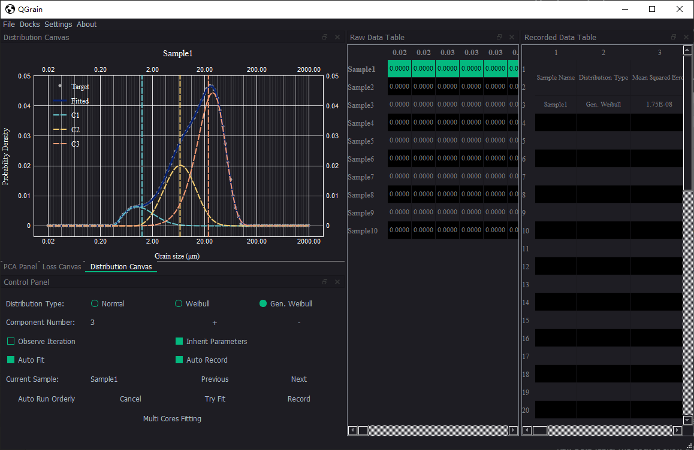

# How to fit the samples

By this, please make sure you have loaded the grain size distribution (GSD) data correctly.

If everything goes well, you will see the interface like this. By default, QGrain has fitted the first sample automatically.

## The layout of app

QGrain consists of some docks which are movable, scalable, floatable, and closable. You can adjust them as you please. If you want to display a dock that has been closed before, you can click the **Docks** menu to realize it.

### Docks

* Cavas: The dock to display the raw data and fitting result of the sample you selected.
* Control Panel: The dock to control the fitting behaviours.
* Raw Data Table: The dock to show the GSD data of samples.
* Recorded Data Table: The dock to show the recorded fitting results.

## Tips

If you are confused to some widgets, you can hover on it to see the tips.

* Click the raido buttons of **Distribution Type** to switch the distribution function.
* Click the **+**/**-** button to add/reduce the component number you guess.
* **Observe Iteration**: Whether to display the iteration procedure.
* **Inherit Parameters**: Whether to inherit the parameters of last fitting. It will improve the accuracy and efficiency when the samples are continuous.
* **Auto Fit**: Whether to automaticlly fit after the sample data changed.
* **Auto Record**: Whether to automaticlly record the fitting result after fitting finished.
* Click the **Previous** button to back to the previous sample.
* Click the **Next** button to jump to the next sample.
* Click the **Auto Run Orderly** button to run the program automatically. The samples from current to the end will be processed one by one.
* Click the **Cancel** button to cancel the fitting progress.
* Click the **Try Fit** button to fit the current sample.
* Click the **Record** button to record the current fitting result.\nNote: It will record the LAST SUCCESS fitting result, NOT CURRENT SAMPLE.
* Click the **Multi Cores Fitting** button to fit all samples. It will utilize all cores of cpu to accelerate calculation.
* Move the lines in **Canvas** dock to set the expected mean values of each component, if it can not return a proper result and you make sure the component is correct.

## Workflow

The workflow of fitting samples is that:

1. Try fit one typic sample untill you are satisfied.

    You can adjust the component number and watch the chart of fitting result to find a proper value.

    If it can not return a correct result, you can check the **Ovserve Iteration** option to find the reason. Also, you can move the lines to test whether the component number is proper.

    If it can return a proper result by giving the expected mean values, you can adjust the algorithm settings to refine the performance to let it can get the proper result automatically.

2. Test other samples with the component number.
3. If the component number are suitable for all samples, use auto fit to process them all.
4. If some results are not correct, cancel the fitting and return the step 1. If the incorrect results are not too many, you can fit and record manually.
5. Save the fitting results to file.
