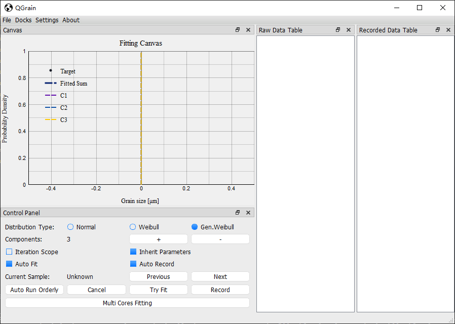

# How to install QGrain

**QGrain** is written by [Python](https://www.python.org/). So, it's **cross-platform**.

It can be installed on **Windows**, **Linux**, **Mac OS X**, etc.

There are two ways to install QGrain.

## 1. Use Python interpreter

This method is for the user who has experience on Python and Shell. If you are unfamiliar with the knowledge, please see method 2 below.

1. Install Python

    For Linux and Mac OS X users, you may have the built-in Python3 interpreter. You can run the command `python` or `python3` in your terminal to check if Python is existing.

    Note: Using `python` or `python3` depends on the alias or the filename of your Python3 interpreter.

    If you do not have Python3 installed, you can visit the [official website of Python](https://www.python.org/downloads/) to download and install the Python interpreter.

2. Download the codes of QGrain

    The repository of QGrain is hosted on GitHub. The link is over [here](https://github.com/QGrain-Organization/QGrain).

    * You can clone the repository by running the following command if you have git installed.

      `git clone https://github.com/QGrain-Organization/QGrain.git`

    * Or, you can download the pure codes directly by clicking [here](https://github.com/QGrain-Organization/QGrain/archive/master.zip).

      If you choose to download the zip file, please extract it.

3. Install requirements

    QGrain has some dependent modules, it's necessary to install them.

    * Change the working directory to the folder of QGrain' codes.

    * Install modules using **pip**.

      `pip install -r requirements.txt`

4. Run QGrain

    Now, everything is ok.

    Please run the command `python qgrain.py` or `python3 qgrain.py` to launch QGrain.

    If it goes well, you can see the app interface like this.

    

## 2. Use executable file

We have packed the executable setup file for **Windows** users.

You can download it from [here](https://github.com/QGrain-Organization/QGrain/releases).
