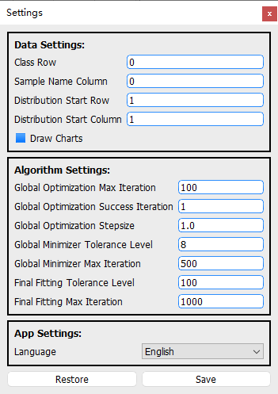

# How to load grain size distribution data

In order to analyze the grain size distribution (GSD), the first necessary step is data loading. Click the **File** menu and select **Load** option to load GSD data from local files.

At present, QGrain supports three file formats, `.csv`, `.xls` (Excel 97-2003) and `.xlsx`.

Note: For `.xls` and `.xlsx`, please put the data table at the **FIRST** sheet. Otherwise, the data can not be loaded.

By default, QGrain assume that the data layout follows:

* The first row should be the headers (i.e. the classes of grain size).
* The following rows should be the distributions of samples under the grain size classes.
* The first column shoud be the name (i.e. id) of samples.

If your layout of data file are not same as this, it will raise exceptions.

If you do not want to modify your data file, you can click the **Settings** menu to modify the default settings of loading data.

There are 4 parameters that control the data loader. They all are row/column index which start with 0 (i.e. 0 means the first row/column).

* Class Row: The row index of grain size classes.
* Sample Name Column: The column index of sample names.
* Distribution Start Row: The start row index (starts with 0) of distribution data. It should be greater than the row index of classes.
* Distribution Start Column: The start column index (starts with 0) of distribution data. It should be greater than the column index of sample name.
