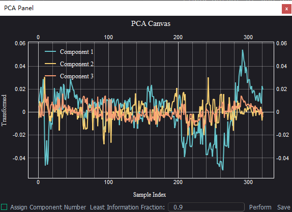
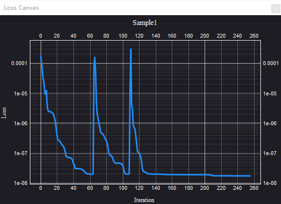
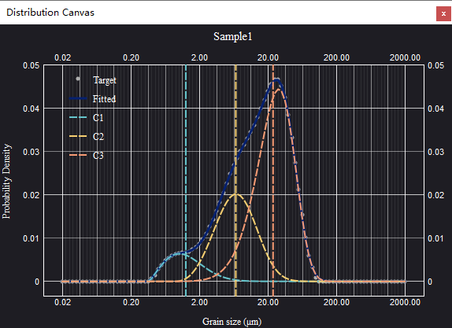
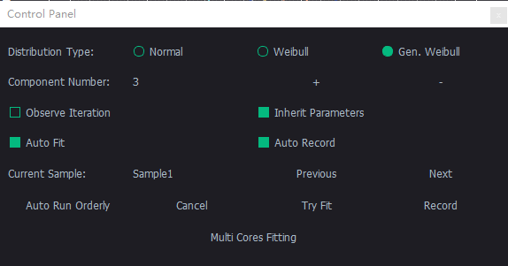
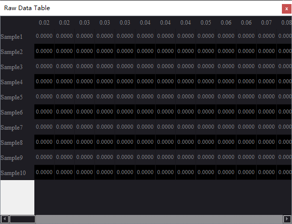
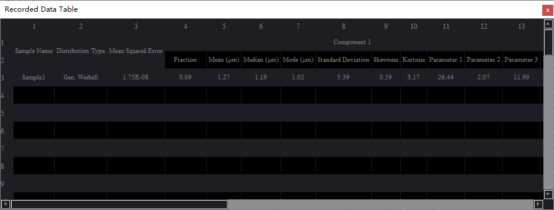

# Overview of UI

## Layout

QGrain consists of several docks, i.e. small child windows. These docks may contains several widgets that collaborate to provide an certain function for users.

The major feature of docks is its flexibility, that is, they are dockable, floatable, movable, scalable, divisible, and closable. These features makes you can adjust the layout as you please if you are not satisfied with it. The customized layout will be stored after you closed this app.

Each dock can dock in main window and become the child window of main winodw. Each child window has its own title bar that
displays its name. By double clicking its title bar or clicking its *Reset* button, you can float this dock, and it will become an independent window. Also, you can drag the title bar to make
it floating.

When you dragging this dock, there is a highlight rectangle to show you the area it will be put in. By this method, you can make the floating dock become docked again. Or, you can move it to another place. If you drag it around another dock, it will split and share the space with that dock. If you drag it on that dock, it will be tabbed, which means there is only one dock can ben displayed at the same time, and you can click the tabs below to switch between them.

If you want to change the sizes of docks, you can drag the separator (i.e. the boundaries of docks) to adjust it. By clicking the *Close* button of dock, you can close the needless dock. If you want to display a dock that has been closed before, you can click the **Docks** menu and select the corresponding option to realize it again.

By default, QGrain puts the docks which have canvas (i.e. chart) in the top left corner, and all these docks are tabified to reduce the occupancy of space. In order to control this app conveniently, the dock of `Control Panel` is in the bottom left corner alone. On the right, there are the docks to display the raw data and recorded results.

If you want to reset the layout to default, you can click the `Reset` option in `Docks` menu.

## Docks

### PCA Panel

The dock to do principal component analysis (PCA) (see the [wiki page](https://en.wikipedia.org/wiki/Principal_component_analysis) for more details). It contains one canvas to show the result and some widgets bellow to control the algorithm.

### Loss Canvas

The dock to dynamically display the process of loss (i.e. the difference between observation and fitting result) changing.

Note: Only take effect when the **Observe Iteration** option of **Control Panel** is checked.

### Distribution Canvas

The dock to dynamically display the distribution of raw data and fitting result of current sample.

For the dock which contains canvas, you can follow the following mouse interaction to adjust the figure.

### Control Panel

The dock to control the fitting behaviours.

#### Tips

* Click the raido buttons of **Distribution Type** to switch the distribution function.
* Click the **+**/**-** button to add/reduce the component number you guess.
* **Observe Iteration**: Whether to display the iteration procedure.
* **Inherit Parameters**: Whether to inherit the parameters of last fitting. It will improve the accuracy and efficiency when the samples are continuous.
* **Auto Fit**: Whether to automaticlly fit after the sample data changed.
* **Auto Record**: Whether to automaticlly record the fitting result after fitting finished.
* Click the **Previous** button to back to the previous sample.
* Click the **Next** button to jump to the next sample.
* Click the **Auto Run Orderly** button to run the program automatically. The samples from current to the end will be processed one by one.
* Click the **Cancel** button to cancel the fitting progress.
* Click the **Try Fit** button to fit the current sample.
* Click the **Record** button to record the current fitting result.\nNote: It will record the LAST SUCCESS fitting result, NOT CURRENT SAMPLE.
* Click the **Multi Cores Fitting** button to fit all samples. It will utilize all cores of cpu to accelerate calculation.
* Move the lines in **Distribution Canvas** dock to set the expected mean values of each component, if it can not return a proper result and you make sure the component is correct.

### Raw Data Table

The dock to show the GSD data of samples.

By clicking the row of sample, you can set this sample as current sample and process it.

### Recorded Data Table

The dock to show the recorded fitting results.

